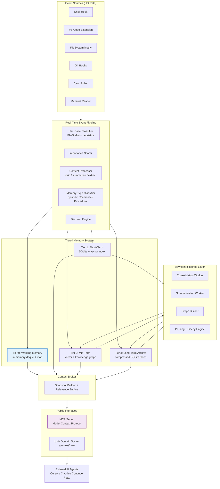

# contextd

**The missing shared cognitive layer for your entire development machine.**

A fully local, Linux-first context broker daemon that watches your shell, editor, filesystem, git, and processes in real time and gives **every AI coding agent** (Cursor, Claude, Continue.dev, Windsurf, terminal agents, etc.) a single, always-up-to-date, structured source of truth about “what you are doing right now”.

No more copy-pasting errors. No more re-explaining your intent. No more context fragmentation.

**Everything runs 100% locally** — no cloud, no API keys, no data ever leaves your laptop.

---

## Problem

Modern developers use 4–6 different AI tools at once:
- Cursor / Continue.dev / Claude Desktop
- Terminal agents
- Browser-based AIs
- Custom agents

Each tool has its own isolated memory. You — the human — become the bottleneck, constantly copy-pasting terminal errors, telling the AI what file you’re editing, what you’re trying to achieve, etc.

**contextd removes the human from the middle.**

---

## Core Features

- **Real-time context snapshot** — `/context/now` returns exactly what any agent needs in < 50 ms
- **Use-case aware** — Automatically detects `coding`, `research`, `general_productivity`, etc. and adjusts processing
- **4-tier hierarchical memory** (inspired by MemGPT + Mem0 + CoALA + 2025 MemoryOS research)
  - Tier 0: Working Memory (live in-RAM snapshot)
  - Tier 1: Short-term (SQLite + vector, 24–48h)
  - Tier 2: Mid-term (vector + knowledge graph — semantic + procedural)
  - Tier 3: Long-term Archive (compressed blobs)
- **Intelligent background intelligence** — consolidation, summarization, graph building, importance-based pruning
- **MCP Server** — native Model Context Protocol support
- **Unix domain socket** — ultra-low-latency local access
- **Privacy-first & offline** — single static Rust binary, runs as systemd user service

---

## Architecture Overview



---

## Tech Stack (Locked)

| Component              | Technology                          |
|------------------------|-------------------------------------|
| Core Daemon            | Rust (single static binary)           |
| Local AI               | Ollama (Phi-3 Mini + nomic-embed-text) |
| Storage                | SQLite + pure-Rust vector similarity  |
| Event Sources          | inotify, Unix sockets, git hooks, /proc |
| Protocol               | MCP (Model Context Protocol) + custom socket |
| VS Code Extension      | TypeScript (thin client)            |
| Shell & Git Hooks      | Bash                                |
| Config                 | TOML                                |

---

## Project Status (March 29, 2026)

- ✅ Full architecture finalized (use-case routing + 4-tier memory)
- ✅ Tech stack & language decision locked (Rust)
- ✅ `claude.md` and `agent.md` written
- 🔨 **Implementation Phase** — building the Rust daemon from scratch

We are currently starting clean implementation following the exact architecture above.

---

## Planned Installation (One-command)

```bash
curl -sSL https://get.contextd.dev | bash
```

After install you will:
1. Add one line to your `.bashrc` / `.zshrc`
2. Install the VS Code extension (one click)
3. Run `contextd intent "fix auth bug in cal.com"` (optional but powerful)

Everything else is automatic.

---

## Quick Start (Development)

```bash
git clone https://github.com/yourusername/contextd.git
cd contextd
cargo build
cargo run
```

(Full setup guide coming in `docs/` once v0 is running.)

---

## Repository Structure (Current)

See the detailed package layout in `claude.md` and `agent.md`.

All production code lives under `internal/`. Public interfaces are in `api/`.

---

## How to Contribute / Help

1. Read `claude.md` (for Claude) or `agent.md` (for any agent)
2. Follow the finalized architecture strictly
3. Keep everything **local-first** and **single-binary friendly**
4. Prefer pure Rust implementations

This is the foundation of what we believe will become a major piece of developer infrastructure in 2026–2027.

---

## Related Standards & Inspiration

- [Model Context Protocol (MCP)](https://modelcontextprotocol.io)
- MemGPT, Mem0, CoALA, MemoryOS (2025)
- AGENTS.md standard

---

**License:** MIT (for now — will switch to Apache 2.0 + open-core model once we ship v1)

---

**Made with love for developers who are tired of being the context bus.**

— Vansh & the contextd team