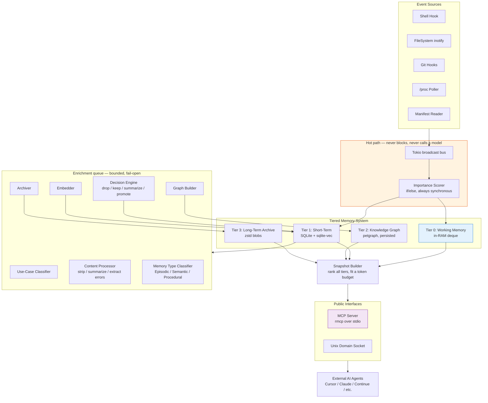

# contextd

**The missing shared cognitive layer for your entire development machine.**

A fully local, Linux-first context broker daemon that watches your shell, editor, filesystem, git, and processes in real time and gives **every AI coding agent** (Cursor, Claude, Continue.dev, Windsurf, terminal agents, etc.) a single, always-up-to-date, structured source of truth about “what you are doing right now”.

No more copy-pasting errors. No more re-explaining your intent. No more context fragmentation.

**Everything runs 100% locally** — no cloud, no API keys, no data ever leaves your laptop.

---

## Problem

Modern developers use 4–6 different AI tools at once:
- Cursor / Continue.dev / Claude Desktop
- Terminal agents
- Browser-based AIs
- Custom agents

Each tool has its own isolated memory. You — the human — become the bottleneck, constantly copy-pasting terminal errors, telling the AI what file you’re editing, what you’re trying to achieve, etc.

**contextd removes the human from the middle.**

---

## Core Features

- **Real-time context snapshot** — the current briefing is served from RAM, so it does not wait on the disk
- **Use-case aware** — sorts activity into `coding`, `research`, and `general_productivity`, and treats each differently
- **4-tier hierarchical memory** (inspired by MemGPT + Mem0 + CoALA + 2025 MemoryOS research)
  - Tier 0: Working Memory (live in-RAM deque)
  - Tier 1: Short-term (SQLite + `sqlite-vec`)
  - Tier 2: Knowledge graph (`petgraph`, persisted and rebuilt on boot)
  - Tier 3: Long-term Archive (zstd-compressed blobs, not deletion)
- **Summaries, not transcripts** — a burst of forty saves becomes one useful line, and briefings are fitted to a token budget
- **Background intelligence** — classification, summarization, embedding, and graph building, none of it on the hot path
- **MCP Server** — `rmcp`, verified against Cursor, Claude Code, and Continue
- **Privacy-first & offline** — one Rust binary, runs as a systemd user service, no network calls off the machine

---

## Architecture Overview


```mermaid
flowchart TD
    subgraph Sources["Event Sources"]
        S1[Shell Hook]
        S3[FileSystem inotify]
        S4[Git Hooks]
        S5["/proc Poller"]
        S6[Manifest Reader]
    end

    Bus[Tokio broadcast bus]
    Score[Importance Scorer<br/>if/else, always synchronous]

    subgraph Hot["Hot path — never blocks, never calls a model"]
        Bus
        Score
    end

    subgraph Enrich["Enrichment queue — bounded, fail-open"]
        P1[Use-Case Classifier]
        P3[Content Processor<br/>strip / summarize / extract errors]
        P4[Memory Type Classifier<br/>Episodic / Semantic / Procedural]
        P5[Decision Engine<br/>drop / keep / summarize / promote]
        B1[Embedder]
        B3[Graph Builder]
        B4[Archiver]
    end

    subgraph Memory["Tiered Memory System"]
        T0[Tier 0: Working Memory<br/>in-RAM deque]
        T1[Tier 1: Short-Term<br/>SQLite + sqlite-vec]
        T2[Tier 2: Knowledge Graph<br/>petgraph, persisted]
        T3[Tier 3: Long-Term Archive<br/>zstd blobs]
    end

    Broker[Snapshot Builder<br/>rank all tiers, fit a token budget]

    subgraph API["Public Interfaces"]
        MCP[MCP Server<br/>rmcp over stdio]
        SOCK[Unix Domain Socket]
    end

    Sources --> Bus --> Score
    Score --> T0
    Score --> T1
    T1 --> Enrich
    P5 --> T1
    B1 --> T1
    B3 --> T2
    B4 --> T3

    T0 & T1 & T2 & T3 --> Broker --> API
    API --> Agents["External AI Agents<br/>Cursor / Claude / Continue / etc."]

    style Hot fill:#fff3e0,stroke:#e65100
    style T0 fill:#e3f2fd,stroke:#1976d2
    style MCP fill:#f3e5f5,stroke:#7b1fa2
```

Everything that could be slow — every model call, every summarization — lives in
the enrichment queue. **Watching never depends on a model being online.**

---

## Tech Stack (Locked)

| Component              | Technology                          |
|------------------------|-------------------------------------|
| Core Daemon            | Rust (single static binary)           |
| Local AI (optional)    | Ollama (`nomic-embed-text`, 768-d)    |
| Storage                | SQLite (WAL) + sqlite-vec + zstd archive |
| Event Sources          | inotify, Unix sockets, git hooks, /proc |
| Protocol               | MCP (Model Context Protocol) + custom socket |
| Shell & Git Hooks      | POSIX sh                            |
| Config                 | TOML                                |

---

## Project Status (September 2026)

The loop this project set out to build works: start the daemon, edit files, run a
build, commit, then open Cursor or Claude and it already knows what you were
doing — with nothing pasted.

- ✅ All four memory tiers, including the knowledge graph and the compressed archive
- ✅ MCP server on `rmcp`, verified against Cursor, Claude Code, and Continue
- ✅ Classification, summarizing, and embedding, all off the hot path
- ✅ Shell hooks, git hooks, TOML config, systemd unit, one-command install
- 🔨 Classifiers are still heuristics; a small local model is the intended upgrade
- ❌ No VS Code extension. The shell and git hooks cover the same ground.

See `docs/build-walkthrough.md` for how it is put together and what is still open.

---

## Install

```bash
git clone https://github.com/vansh5632/contextd.git
cd contextd
./install.sh
```

That builds the binary, installs it to `~/.local/bin`, writes the shell hook, git
hooks, and a systemd user unit, and starts the daemon. Then point your agent at
it — see `docs/connecting-agents.md`:

```json
{
  "mcpServers": {
    "contextd": { "command": "contextd", "args": ["mcp"] }
  }
}
```

Optionally tell it what you are doing, which makes every later briefing sharper:

```bash
contextd intent "fix auth bug in cal.com"
```

Ollama is optional. Without it you lose semantic search and "when did I last hit
this error"; everything else works unchanged.

---

## Commands

| Command | What it does |
|---|---|
| `contextd run` | Run the daemon in the foreground |
| `contextd mcp` | Speak MCP over stdio. This is what an agent launches. |
| `contextd intent <text>` | Record what you are working on |
| `contextd status` | Is it running, and what does it currently hold |
| `contextd install` | Set up shell hooks, git hooks, and the systemd unit |
| `contextd uninstall` | Undo that, leaving your recorded context alone |

Configuration lives at `~/.config/contextd/config.toml`; data at
`~/.local/share/contextd/`. `contextd status` prints both.

---

## Development

```bash
cargo build
cargo test --workspace
cargo run -- run
```

CI enforces `cargo fmt --check`, `cargo clippy -D warnings`, and
`cargo test --workspace`. See `CONTRIBUTING.md` and `TESTING.md`.

---

## How to Contribute / Help

1. Read `claude.md` (for Claude) or `agent.md` (for any agent)
2. Follow the finalized architecture strictly
3. Keep everything **local-first** and **single-binary friendly**
4. Prefer pure Rust implementations

This is the foundation of what we believe will become a major piece of developer infrastructure in 2026–2027.

---

## Related Standards & Inspiration

- [Model Context Protocol (MCP)](https://modelcontextprotocol.io)
- MemGPT, Mem0, CoALA, MemoryOS (2025)
- AGENTS.md standard

---

**License:** MIT (for now — will switch to Apache 2.0 + open-core model once we ship v1)

---

**Made with love for developers who are tired of being the context bus.**

— Vansh & the contextd team